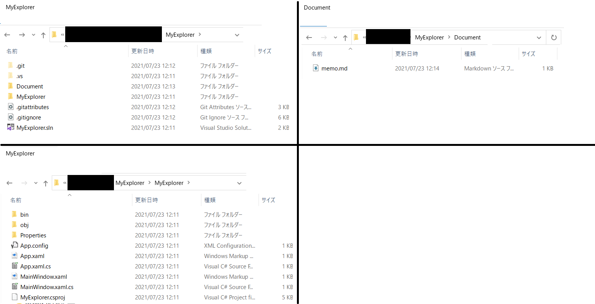

# 目的
- 作業中に時々起こる、作業フォルダ開きすぎて画面やタスクバーがとっちらかる問題を解決したい

# 機能イメージ
## マルチフォルダ表示
- イメージ
  - 
- 起動直後は1フォルダ表示
  - フォルダのドラッグ＆ドロップや、表示中フォルダからフォルダを `Ctrl + Enter` すると増やせる
  - 最大 4 フォルダの同時表示
    - 将来的には拡張したい？
  - 2 つのフォルダ表示の場合、2 行での表示や 2 列での表示も可能
  - 表示領域の指定(フォルダ区切り線のドラッグ＆ドロップによる移動)
  - 起動時に前回表示フォルダを再現する機能も入れたい
- フォルダ表示にプロンプト表示機能も入れたい
  - そのフォルダに cd している状態のプロンプトをそのまま立ち上げるイメージ
  - プロンプトより Git Bash かも
    - 立ち上げられるプログラムを設定できるようにする
- 今フォーカスが当たっているフォルダが一目でわかると嬉しい

## fenrir のような使いやすさ
- 本 exe 実行中は裏で常駐して、`Capslock` キーで本 exe の画面を立ち上げられるようにする

## エクスプローラー機能
### あって当然の機能
- 各種ショートカットキー
  - `Alt + → or ←` キー: 表示フォルダの移動(履歴遷移)
  - `Delete` キー: ファイルやフォルダの削除
  - `Shift + F10` キー: Windows のエクスプローラーで右クリックしたときに表示されるメニュー
  - `Ctrl + z` キーによる作業取り消し？
  - `上下` キー: 現在選択中ファイルの移動
  - `Shift + 上下` キー: ファイルの複数選択
- マウス操作
  - ドラッグ＆ドロップによるファイルの複数選択
- ファイルやフォルダの並び替え
  - 名前、更新日時、種類、サイズ
  - それぞれ昇順 / 降順でソート可能
- サムネイル表示との切替
  - 基本は Windows でいう詳細表示

### 追加機能
- マウス操作でない機能は `Shift + F12` 等のショートカットで一覧を表示する
  - `Shift + F10` とは表示を分ける
- フォルダ間のやり取り
  - ファイルやフォルダのコピー / 移動
    - ドラッグ＆ドロップでやりたい
    - ドロップした時に コピー or 移動 を聞く
- WinMerge の呼び出し
  - 今開いているフォルダ同士の比較
- ファイルやフォルダのパスコピー
- お気に入り
  - ファイルやフォルダを登録できる
  - ファイルの場合はすぐに開かず、そのファイルが存在するフォルダを表示し、お気に入りファイルを初期選択状態とする
- ドライブフォルダとユーザーフォルダ(C:\Users 以下)への直接アクセス手段を提供する
  - この 2 種類は手動でアクセスしようとすると意外と面倒

# 要技術調査
## 項目
- フォルダ表示にプロンプト表示機能も入れたい
  - そのフォルダに cd している状態のプロンプトをそのまま立ち上げるイメージ
  - ★できれば VSCode みたいにフォルダ表示の下側にでも追加表示したい
- 本 exe 実行中は裏で常駐して、`Capslock` キーで本 exe の画面を立ち上げられるようにする
  - ★グローバルホットキー、になるのか？
- `Shift + F10` キー: Windows のエクスプローラーで右クリックしたときに表示されるメニュー
  - ★Windows のあのメニューそのままって呼び出せるの？
- ファイルやフォルダのパスコピー
  - ★クリップボードへの出力
- fenrir みたいにタスクトレイに常駐させる

## 調査結果
- Windows のエクスプローラーで右クリックしたときに表示されるメニューをそのまま取得したい
  - https://teratail.com/questions/204729
    - https://docs.microsoft.com/ja-jp/windows/win32/shell/folderitem
      - Shell.Application COM オブジェクトを作り、
      - Namespace メソッドで Folder オブジェクトを取得し、
      - Items をたどって目的の FolderItem オブジェクトを取得し、
      - Verbs を取得する
- ファイルやフォルダのパスコピー、クリップボードへの出力
  - Clipboard クラスの static な SetData() を実行することで出力できる
- フォルダ表示にプロンプト表示機能も入れたい、できれば VSCode みたいに埋め込みたい
  - PowerShell
    - http://grabacr.net/archives/7331
      - `System.Management.Automation.dll`
        - NuGet から `Microsoft.PowerShell.5.ReferenceAssemblies` をインストール
  - Git Bash
    - 多分これでいける
    - https://qiita.com/kouh/items/7b55fbc72ffc91983575
- 本 exe 実行中は裏で常駐して、`Capslock` キーで本 exe の画面を立ち上げられるようにする
  - 多分これでいける
    - グローバルキーフックを設定
    - `Capslock` キー以外はそのまま通す
    - `Capslock` キーだけはソフト側の処理を呼び出して画面を表示して、`Capslock` キー入力を破棄する
    - fenrir みたいにするにはウィンドウ close でもアプリが終わらないようにする
      - exe のメインは MainWindow ではなく別を App.xaml に指定
      - exe のメインは以下を実行
        - グローバルキーフックを設定
        - MainWindow を別プロセスで実行
        - while(true) sleep(20ms程度？)
          - このときグローバルキーフックで `Capslock` を引っかけたら別プロセスで MainWindow を立ち上げる
- fenrir みたいにタスクトレイに常駐させる
  - C# タスクトレイ 常駐 でヒットする
